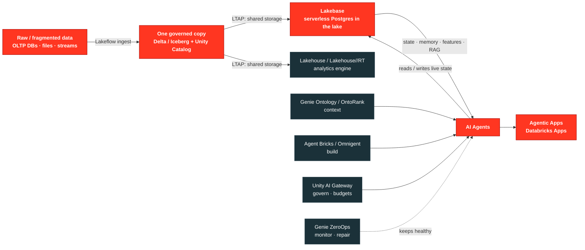
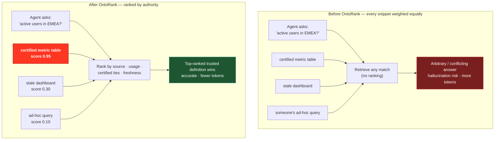

# From Raw Data to Agentic Apps — A Field Guide to the Databricks Data + AI Platform

> A narrative walkthrough of the Databricks **Data + AI Summit 2026** keynote, reconstructed from session slides
> and enriched with official Databricks documentation and supporting open-source repositories.
>
> The keynote framed Lakebase as the database an AI agent needs; this guide unpacks why that's true and traces the
> full arc: **raw, fragmented data → one governed copy (LTAP) → Lakebase (transactional Postgres in the lake) →
> context, build, and ops → a production agentic app.**
>
> **Audience:** AI / ML engineers who want to understand how raw data becomes the transactional layer an agent
> runs on, and how that layer powers a real agentic application.

---

## TL;DR — the story in one paragraph

Enterprises start with a **fragmented "data realm"**: OLTP databases, data warehouses, data science notebooks,
and streaming systems that never talk to each other. Databricks' answer is to collapse that fragmentation onto
**one copy of data in the lake** using a new architecture called **LTAP (Lake Transactional/Analytical
Processing)**. The transactional face of that single copy is **Lakebase** — fully managed, serverless Postgres
built on the lakehouse storage foundation. An agent's hardest runtime requirements — low-latency state and memory,
online features, RAG retrieval, and per-run isolation — are exactly what a transactional database sitting *inside*
your governed data provides, which is why Lakebase sits at the center of this story. On top of Lakebase, Databricks
layers **context** (Genie Ontology), **a build surface** (Agent Bricks +
the open-source Omnigent harness), and **autonomous operations** (Genie ZeroOps). The payoff is an **agentic
app**: a production application whose agent reasons over, writes to, and acts on the *same* data — at millisecond
latency, with no pipelines in between. That is the full arc of this guide, from raw data to agentic app.

---

## The flow at a glance

The red path is the spine of this guide — **raw data → Lakebase → AI agents → agentic apps**. The grey nodes are
the supporting layers that feed the agent (context, build, governance, ops). Note the **bidirectional arrow**
between the agent and Lakebase: the agent both reads its context from and writes its live state back to the same
database.



> If you're viewing this outside GitHub (where Mermaid doesn't render), the same arc is shown as plain text in
> [How to read this repo](#how-to-read-this-repo) below.

---

## How to read this repo

These notes were captured from photographed keynote slides. Where a slide introduced a product, this README
links to the **official Databricks documentation, blog, or press release** so you can go deeper. Product names
marked *(DAIS 2026)* were announced at the summit and may still be in preview.

The flow below follows the keynote's own arc:

```
Raw / fragmented data  ─▶  LTAP (one copy of data)  ─▶  LAKEBASE
        │                                          (transactional Postgres in the lake)
        └────────── Unity Catalog governs everything ──────────┘
                                   │
                                   ▼
              Context (Genie Ontology) + Build (Agent Bricks / Omnigent)
                                   │
                                   ▼
        Production AI Agent  ─▶  Genie ZeroOps keeps it healthy
                                   │
                                   ▼
                      AGENTIC APP  (the destination)
```

---

## Chapter 1 — "The Known Data Realm": why fragmentation is the enemy

One keynote slide showed a fantasy-map illustration titled **"The Known Data Realm"** — separate continents for
**OLTP Databases**, **Data Engineering**, **Data Warehousing**, **Data Science**, and **Real-Time Analytics**,
with rivers (labeled *Lakeflow* and *Lakebase*) trying to connect them.

The point: in a typical stack, **operational data lives in one system and analytical data in another**. Moving
between them requires **CDC pipelines, ETL jobs, and duplicate copies** — every copy a chance for data to drift,
go stale, or fall out of governance. For an AI engineer this is the root cause of most agent failures: the agent
either reasons over stale analytical snapshots or can't write state back to where the app can use it.

**The thesis of the whole keynote:** unify the realm onto a single, open, governed copy of data.

---

## Chapter 2 — LTAP: one copy of data for transactions *and* analytics

**LTAP — Lake Transactional/Analytical Processing** *(DAIS 2026)* is the architectural foundation. The slides
framed it as **"truly unifying data infrastructure"** with three promises:

| Promise | What it means | Why an AI engineer cares |
|---|---|---|
| **No data duplication** | A single copy of data lives in the lake (open Delta / Iceberg format). | The agent and the app read the *same* rows — no reconciliation. |
| **No compromise performance** | Workload isolation with interchangeable compute; transactional and analytical engines hit the same storage. | Low-latency reads/writes for the app *and* large scans for training. |
| **No pipelines** | Fresh data with **no CDC — "not even hidden CDC."** | State written by an agent is instantly queryable analytically. |

The stack underneath is **Postgres + Delta Lake / Iceberg**, described as **open and interoperable**. A
*"Coming Soon"* slide announced an **open-source LTAP Writer Library** that stores PostgreSQL data directly in
**Apache Parquet**, readable by any Parquet/open-table reader, supporting complex Postgres types and extensions,
and **fully compatible with Unity Catalog managed tables**.

### The mechanism: unified *storage*, isolated *compute*

The single most important thing to understand about LTAP is **how** it serves both workloads — because it is
**not** "one engine that does both at once." That older idea (classic **HTAP**) always compromised, because
forcing transactional and analytical work through a single engine means one side starves the other. LTAP takes a
different approach, stated plainly in the announcement: *"rather than forcing both workloads into one engine or
concealing the pipeline, it unifies data at the storage layer,"* and *"transactional and analytical workloads
scale independently with full performance and strict isolation."*

So the rule is: **unify at the storage layer, keep compute isolated.**

```
        Transactional compute (Postgres / Lakebase)   ──▶  writes/reads, low latency
                          │
                          ▼
   ONE COPY of data  ──  object storage · Delta / Iceberg · Unity Catalog
                          ▲
                          │
        Analytical compute (Lakehouse / Lakehouse//RT)  ──▶  big scans, training, BI
```

Both run **simultaneously** because they are **separate, independently-scaling compute tiers over shared
storage** — analytical scans don't starve the transactional app (strict isolation), and a transactional write is
**immediately** analytically queryable because there is literally one copy and no CDC. Compare the three models:

| | Two systems (classic OLTP + OLAP) | Classic HTAP | **LTAP** |
|---|---|---|---|
| Copies of data | 2, glued by CDC/ETL | 1 | 1 |
| Compute | Separate engines, *separate data* | **One engine does both** → compromises | **Separate, isolated tiers** |
| Freshness | Pipeline lag | Real-time | Real-time, no pipeline |
| Format | Proprietary per system | Usually proprietary | Open (Delta / Iceberg) |

> **Mental model:** LTAP is the *architecture* (one copy of data, two isolated compute tiers). **Lakebase** is the
> *transactional tier* you write/read at low latency, and the **Lakehouse** is the *analytical tier* you scan at
> scale — both pointed at the same governed storage.

### How Lakebase relates to the Lakehouse (it's built *on* the lakehouse storage)

It's worth being precise here, because "Lakehouse" means two different things and they sit at different layers:

- **Lakehouse-as-foundation** — the open storage layer: cloud object storage + open table formats (Delta/Iceberg)
  + Unity Catalog governance.
- **Lakehouse-as-engine** — the analytical engine/product (Spark/Photon, and now **Lakehouse//RT**) that scans
  that storage.

**You never "set up" a Lakehouse.** Because the Lakehouse is this storage foundation — not a product you spin up —
**every piece of raw data you land as a governed open-format table automatically becomes part of the lakehouse.**
There is nothing separate to build, provision, or turn on; the lakehouse is simply what your governed Delta /
Iceberg tables *are*. Under LTAP this extends to Lakebase: its transactional writes are stored in the same open
formats under Unity Catalog, so operational data written by an app or agent **automatically joins the lakehouse
too** — no pipeline, no copy. In practice you provision *compute* (a Lakebase instance, an analytical warehouse)
and *land data*; the lakehouse is what those produce together.

Under LTAP, **Lakebase is built on the lakehouse storage foundation.** The announcement is explicit: Lakebase is
*"serverless Postgres deployed on object storage — the same storage layer powering the Lakehouse,"* and *"Lakebase
stores data directly in Unity Catalog, using the same open formats as the Lakehouse."* So Lakebase is **not** a
separate database with its own siloed storage parked next to the lakehouse — it persists into the *same* governed
object storage.

What Lakebase is **not** built on is the analytical *engine*: its transactional compute is its own isolated tier,
not requests routed through Spark/Photon. So the two true statements are:

- *Layering view:* Lakebase is built **on top of** the lakehouse's storage + governance foundation. ✅
- *Compute view:* Lakebase and the analytical Lakehouse are **sibling engines** over that one copy — neither runs
  "through" the other. ✅

Both describe the same architecture from different layers; that's the picture an AI engineer should hold.

The keynote also introduced **Lakehouse//RT** *(DAIS 2026)* — a real-time analytical engine powered by the new
**Reyden** engine that pushes the analytical tier toward **sub-100ms latency at high concurrency**, so even
"analytical" queries are fast enough to sit inside an agent's decision loop.

📚 [Lakehouse reference architectures](https://docs.databricks.com/aws/en/lakehouse-architecture/reference) ·
[Well-architected data lakehouse](https://docs.databricks.com/aws/en/lakehouse-architecture/well-architected) ·
[Databricks launches LTAP — press release](https://www.databricks.com/company/newsroom/press-releases/databricks-launches-ltap-first-lake-transactionalanalytical) ·
[Lakebase Postgres overview](https://developers.databricks.com/docs/lakebase/overview)

---

## Chapter 3 — Lakebase: the transactional layer an agent runs on

This is the center of gravity for an AI engineer, and the part the rest of the architecture exists to enable. In
the simplest terms, **Lakebase is the database *in* Databricks** — the platform's own built-in, fully managed,
serverless, **Postgres-compatible** operational database. There is no separate database product to evaluate or
bolt on: Lakebase *is* the database. It runs co-located with your lakehouse, so instead of standing up an external
operational database and wiring CDC back to analytics, Lakebase *is* the operational face of your governed data.

Here's why it's the database an agent actually needs. An agent's runtime needs are transactional-database needs:
read/write state every turn, serve features in milliseconds, retrieve context, isolate runs. A data *warehouse*
can't do this — too slow, append-oriented. A *bolted-on* Postgres can, but then its data is siloed from the lake
and the agent reasons over a stale copy. Lakebase is the first option that is **both** a real low-latency Postgres
**and** natively part of the governed lake. The per-need mapping is in
[§ Why this is the bridge to agents](#why-this-is-the-bridge-to-agents) below.

### What makes Lakebase different from "just Postgres"

- **It's real Postgres.** Standard wire protocol, extensions, and SQL — your app code and ORMs work unchanged.
- **Co-located with the lakehouse.** Operational writes and analytical reads share storage and **Unity Catalog**
  governance, so there's no governance gap between "app data" and "warehouse data."
- **Instant branching (copy-on-write).** Spin up isolated database copies in seconds — like `git branch` for your
  data — for testing, evals, or per-agent sandboxes. Branches share unchanged pages, so they're cheap.
- **Autoscaling & scale-to-zero.** Scales up under load, down when idle, and to **zero** when unused (no idle
  compute cost) — resuming on the next query. Ideal for spiky agent traffic.
- **Cross-cloud, fully-managed Disaster Recovery** *(DAIS 2026)*. The slides introduced the **"first fully-managed,
  cross-cloud DR"** for Lakebase: a primary with synchronous replicas, with three design goals —
  *resiliency across any region*, *availability whenever you need your data*, and *control by workload and cost
  constraints.*
- **Lakebase Search.** Hybrid **vector + full-text** retrieval inside the same database — so RAG/agent retrieval
  doesn't require a separate vector store.

### Why this is the bridge to agents

An AI agent needs a place to keep **state, memory, chat history, sessions, and logs** at low latency — and it
needs **online features** to make decisions. Lakebase is purpose-built for exactly this:

| Agent need | Lakebase role |
|---|---|
| Conversation / session memory | Low-latency Postgres tables the agent reads & writes turn-by-turn |
| Online feature store | Sync Unity Catalog feature tables into Lakebase for millisecond serving |
| Tool/action state & audit | Transactional writes that are *immediately* analytically queryable (no CDC lag) |
| RAG retrieval | Lakebase Search (vector + full-text) co-located with operational data |
| Per-agent isolation | Instant branches give each agent/run a cheap, isolated database copy |

📚 [Lakebase Postgres docs](https://developers.databricks.com/docs/lakebase/overview) ·
[Create & manage a database instance](https://docs.databricks.com/aws/en/oltp/instances/create/) ·
[Get a Postgres database (quickstart)](https://docs.databricks.com/aws/en/oltp/projects/get-started) ·
[Lakebase as a transactional layer for Databricks Apps (blog)](https://www.databricks.com/blog/how-use-lakebase-transactional-data-layer-databricks-apps) ·
[Product page](https://www.databricks.com/product/lakebase)

---

## Chapter 4 — Unity Catalog: the governance spine that makes agents safe

Every layer in the keynote sat on **Unity Catalog**. For agents, governance isn't a compliance checkbox — it's
what lets you give an autonomous system access to data *and* sleep at night. Unity Catalog was shown extended with
**Business Glossary, Domains, and Metrics**, which feed semantic meaning into the agent layer (next chapter).

### Unity Catalog ↔ Lakebase: the metadata & governance layer (not the data)

A common question: *is Unity Catalog the metadata for Lakebase?* Roughly yes — it's the **unified governance and
metadata layer that sits above the data**, holding the *information about* your Lakebase tables, not the rows
themselves. Under LTAP, *"Lakebase stores data directly in Unity Catalog, using the same open formats as the
Lakehouse,"* so Unity Catalog is the **single** catalog and governance layer across both your transactional
(Lakebase) and analytical (Lakehouse) data. What it holds:

- **Catalog metadata** — the `catalog.schema.table` namespace, table/column definitions and types, locations, tags.
- **Governance** — grants/permissions, including **fine-grained row- and column-level** controls (the "extra info"
  beyond just table-level access).
- **Lineage** — what produced a table and what consumes it, spanning Lakebase *and* the lakehouse.
- **Audit** — who read or changed what.
- **Semantic context** *(DAIS 2026)* — Business Glossary, Domains, Metrics (also what powers Genie Ontology).

Two caveats keep the model exact:

- **Unity Catalog is not the data.** The rows live in the Postgres-on-object-storage layer (open Delta/Iceberg);
  UC is the card catalog + access control + lineage on top, not a copy of the data.
- **Lakebase keeps its own internal catalog too.** Being Postgres, it has system catalogs (`pg_catalog`, indexes,
  MVCC visibility) that the engine uses at query time. That *operational* metadata is separate from Unity Catalog:
  **UC governs and catalogs the tables; Postgres's internal catalog runs the transactions.**

Two governance products specific to the agentic stack:

- **Unity AI Gateway** *(DAIS 2026)* — a single entry point and **runtime governance layer for every model and
  agent call**. The slide listed three jobs: *unified entry point and token capacity for models and agents*,
  *set AI spend and budgets by user and team*, and *enforce safety, compliance, auditing, and identity on every
  model call.* This is how you cap agent spend, route requests, apply guardrails, and get unified tracing.
- **OpenSharing** *(DAIS 2026)* — an extension of the Delta Sharing protocol to **AI assets** (agent skills,
  models, Genie Agents), with cross-region replication and on-prem compatibility.

📚 [Unity AI Gateway product page](https://www.databricks.com/product/artificial-intelligence/agent-bricks) ·
[Unity Catalog docs](https://docs.databricks.com/aws/en/data-governance/unity-catalog/)

---

## Chapter 5 — Context: Genie Ontology turns governed data into understanding

Governed, unified data is necessary but not sufficient — an agent also needs to know **what the data *means***.
That's **Genie Ontology** *(DAIS 2026)*, described on the slides as a **self-improving knowledge graph** that
**continuously learns enterprise context** from tables, dashboards, and 50+ connected apps.

The mind-map slide showed the Ontology connecting a central node out to:

- Governance & Data Lineage
- Data Semantics & Quality
- Custom Evaluation Suite
- Live Infra State
- Deployment Approval Gates
- Experiment History
- Compute / Cost Policies
- Business Metrics
- Team Workflows (Build / Eval / Ship)

In other words, the Ontology is the **shared brain** that every Genie agent draws on: business meaning, quality
signals, operational state, and the rules of how your team ships. This is what lets an agent answer "what's our
churn metric for the EMEA domain?" correctly instead of guessing at column names.

### OntoRank — "PageRank for company data"

The technical core of Genie Ontology is the **OntoRank** algorithm *(DAIS 2026)*. The Ontology automatically
extracts thousands of candidate "knowledge snippets" — definitions, metrics, joins, query patterns — from tables,
queries, dashboards, pipelines, and connected apps. The problem is that these snippets **conflict**: two teams
define "active user" differently, an old dashboard contradicts a certified table, etc. OntoRank resolves this the
way **Google PageRank** resolves the authority of web pages — by computing an **authority score** for each snippet
rather than treating all context equally.

For an AI engineer, this is the part that matters for retrieval quality: an OntoRank score weighs

- **where a definition came from** (source) and **the authority of that source's author**,
- **how often people rely on it** (usage / reinforcement),
- **how closely it ties to certified and widely-used assets**, and
- **how fresh it is** (recency).

The result is that when an agent pulls context, it retrieves the **highest-authority, most-trusted** definition
instead of an arbitrary or stale one — which directly reduces hallucinations and **lowers token cost** (less junk
context in the prompt). Think of OntoRank as the ranking function that turns a noisy pile of extracted metadata
into a trustworthy, ordered context layer for every agent call.

The difference is easiest to see by comparing retrieval **before** and **after** OntoRank for the same question
(scores are illustrative):



The mechanism is the same in both cases — extract snippets, retrieve for a query — but OntoRank inserts a
**ranking step** so the agent is handed the certified, frequently-used, fresh definition instead of whichever
snippet happened to match.

📚 [Introducing Genie One, Genie Ontology, and Genie Agents (blog)](https://www.databricks.com/blog/introducing-genie-one-genie-ontology-and-genie-agents) ·
[Genie Ontology & Genie One (press release)](https://www.databricks.com/company/newsroom/press-releases/databricks-launches-genie-one-all-new-agentic-coworker-every-team) ·
[Not PageRank but OntoRank — context & authority for AI (ITdaily)](https://itdaily.com/blogs/cloud/databricks-genie-ontology/)

---

## Chapter 6 — Build: Agent Bricks + Omnigent

With unified data (Lakebase), governance (Unity Catalog/AI Gateway), and context (Genie Ontology) in place, you
build agents. The slides organized **Agent Bricks** *(DAIS 2026)* around **Choice → Context → Control**:

| Pillar | What the slide showed |
|---|---|
| **Choice** | **Models:** frontier *and* custom models (Anthropic, OpenAI, Gemini, Grok, Kimi, …). **Orchestration:** managed **Omnigent**, custom agents, agentic tasks. |
| **Context** | **Knowledge, Data & Memory:** documents, tables, volumes, **Memory API**, and **Lakebase**. **Tools:** MCP, skills, agent tools. |
| **Control** | **Deployment** + **Governance** via Unity AI Gateway. |

Note that **Lakebase appears explicitly as the memory/context substrate for Agent Bricks** — closing the loop from
Chapter 3.

### Omnigent — the open-source meta-harness

**Omnigent** *(DAIS 2026, Apache-2.0, alpha)* is the open-source **meta-harness** under Agent Bricks. It wraps any
agent harness — **Claude Code, Codex, Cursor, Pi, LangGraph, CrewAI, Agno, OpenAI Agents SDK** — in a *runner*
with a sandboxed session and a unified API: *messages and files flow in; text streams and tool calls flow out.*
You can **swap harnesses without rewriting**, and enforce **policies, cost budgets, and sandboxing** centrally.
Agent Bricks is the **managed** version of Omnigent.

📚 [Agent Bricks (DAIS 2026 blog)](https://www.databricks.com/blog/agent-bricks-dais-2026) ·
[Agent Bricks product page](https://www.databricks.com/product/artificial-intelligence/agent-bricks) ·
[Build, evaluate & deploy a retrieval agent (tutorial)](https://docs.databricks.com/aws/en/generative-ai/tutorials/agent-framework-notebook) ·
💻 [github.com/omnigent-ai/omnigent](https://github.com/omnigent-ai/omnigent)

---

## Chapter 7 — Operate: "agent-ready" ML and Genie ZeroOps

The final arc was about keeping agentic/ML systems alive in production — *"We made it agent-ready: serverless
everything."* A slide mapped the **ML lifecycle** (Data → Features → Training → Evaluation → Deployment →
Monitoring) onto Databricks products, with **Lakeflow + Lakebase at the Data layer**, Feature Store/Serving,
**AI Runtime** for training, MLflow for evaluation, Model Serving for deployment, and Lakehouse Monitoring.

Two engineer-facing agents close the loop:

- **Genie Code** *(DAIS 2026)* — *"an agent for production ML engineering."* Native to Unity Catalog and every
  Databricks ML product, powered by Genie Ontology (your context & workflows built-in), it builds models and
  pipelines, debugs failures, and improves production systems — with parallel threads and scheduled tasks for
  agentic, long-running work. *(It also has BI/dashboard conveniences, not covered here.)*
- **Genie ZeroOps** *(DAIS 2026)* — *"an agent that runs your ML systems."* It **watches every production model
  continuously, investigates and resolves issues autonomously, and brings you deployment-ready fixes to approve.**
  The operating loop is **Detect → Diagnose → Repair → You approve**, covering:
  - **Data Drift** — catches the drift, retrains, revalidates
  - **Serving Errors** — isolates the cause, rolls back, restores serving
  - **Broken Pipelines** — traces it upstream, repairs the job, restores the flow

Underpinning training is **AI Runtime** *(DAIS 2026)* — **serverless GPU compute for enterprise deep learning**:
powerful GPUs on-demand, research-grade and enterprise-scale, with **multi-node training**. Genie Code
automatically moves jobs onto AI Runtime when a GPU is needed.

### How ZeroOps detects data drift (worked example)

ZeroOps doesn't ship a new drift detector — it watches the platform's existing observability layer (**inference
tables + Lakehouse Monitoring**) and acts on it autonomously. The chain:

1. **Inputs & outputs are captured.** A served model's **inference table** automatically logs every request and
   response as a Unity Catalog Delta table; together with the upstream feature tables, that gives ZeroOps the live
   distribution of model inputs *and* predictions.
2. **Lakehouse Monitoring computes drift.** Each monitor run emits a **profile metrics** table (per-window stats:
   mean, stddev, % nulls, counts) and a **drift metrics** table comparing the current window against a **baseline**
   (the training / "expected" distribution) and against the **previous window**.
3. **The statistics.** Per feature it runs distribution tests and distance measures — **Chi-square, KS,
   Jensen–Shannon, Wasserstein, total variation** — plus simple shifts (mean, % null). Crossing a threshold flags
   that column. This catches **input/feature drift**, **prediction drift**, and (once labels arrive)
   **model-quality drift**.
4. **ZeroOps interprets it continuously.** A model can have zero pipeline errors and still produce bad
   predictions, so ZeroOps watches whether *outputs stay trustworthy*, not just whether jobs succeed.
5. **Then it repairs.** It diagnoses the cause, **trains a corrected candidate on corrected features, evaluates it
   against the same eval suite the production model was held to**, and brings you a validated, deployment-ready fix
   to approve before it touches live traffic.

In one line: **inference tables supply the data → Lakehouse Monitoring computes statistical drift vs. a baseline →
ZeroOps interprets it and proposes a validated retrain.**

📚 [Genie Code docs](https://docs.databricks.com/aws/en/genie-code/) ·
[What's new in Genie Code (DAIS 2026)](https://www.databricks.com/blog/whats-new-genie-code-data-ai-summit-2026) ·
[Introducing Genie ZeroOps](https://www.databricks.com/blog/introducing-genie-zeroops) ·
[Lakehouse Monitoring — metric tables](https://docs.databricks.com/en/lakehouse-monitoring/monitor-output.html) ·
[AI platform: agents for ML engineering & deep learning (blog)](https://www.databricks.com/blog/whats-new-ai-platform-agents-ml-engineering-our-deep-learning-platform-and-new-capabilities)

---

## Chapter 8 — Ship: the agentic app (where the arc lands)

The destination of the whole story is the top row of the platform — **Agentic Apps**. An *agentic app* is a
production application whose core logic is an agent: it takes user intent, reasons with context, calls tools, and
**reads/writes live state** as it works. Everything in Chapters 1–7 exists to make that app possible, and Lakebase
is the piece that makes it work.

Here's the full circle, made concrete. In a running agentic app:

- **The app's data layer is Lakebase** — the same Postgres the agent uses for session/memory state is the database
  the application reads and writes. One database, not an app DB plus an agent DB.
- **The agent's context comes from the lake it's already part of** — features, documents, and tables are *right
  there* (no CDC), ranked by **Genie Ontology / OntoRank** so the agent retrieves trusted definitions.
- **Every action is governed** by **Unity AI Gateway** (budgets, guardrails, identity) and **Unity Catalog**
  (data permissions) — the same governance whether a human or an agent is acting.
- **It stays healthy** because **Genie ZeroOps** watches the models and pipelines underneath and brings fixes to
  approve.

The payoff is direct: the agent runs on Lakebase, and on top of that one governed copy of data you ship an
**agentic app** without stitching together a separate operational database, vector store, feature store, and
analytics warehouse. **Raw data in; agentic app out.**

📚 [Databricks Apps](https://docs.databricks.com/aws/en/dev-tools/databricks-apps/) ·
[Lakebase as a transactional layer for Databricks Apps](https://www.databricks.com/blog/how-use-lakebase-transactional-data-layer-databricks-apps)

---

## The whole platform on one slide

The keynote's summary slide — **"The Data + AI Platform"** — grouped everything under **"Context. Control.
Choice."** and three taglines: *one place to govern Data+AI · one place to control AI costs · any data, any model,
any cloud, no lock-in.*

| Layer | Products (from the slide) |
|---|---|
| **Agentic Apps** | Apps |
| **Agentic Dev & Work** | Genie (One · App Builder · Agents · ZeroOps · Code) |
| **Agentic Data** | **Lakehouse//RT** (powered by Reyden) · **Lakebase** (DR · Search) · **Lakeflow** · **LTAP** |
| **Context, Control, Choice** | **Genie Ontology** · **Omnigent OSS** · **Unity AI Gateway** · **Agent Bricks** (powered by Omnigent) · **OpenSharing** |
| **Agentic Marketing & Security** | **CustomerLake** · **Lakewatch** (with Panther) |
| **Open infrastructure** | Any Cloud · Any Model · Any Data |

Supporting cast from the slides (data/AI-relevant):

- **Reyden** *(DAIS 2026)* — the new low-latency, high-concurrency engine under Lakehouse//RT.
- **Lakehouse//RT** *(DAIS 2026)* — real-time data warehouse (sub-100ms latency at high QPS) on Delta/Iceberg.

> *Domain apps built on the same stack — **CustomerLake** (agentic CDP for marketing) and **Lakewatch**
> (lakehouse-native SIEM for security) — were also shown, but are business-facing applications rather than core
> data/AI primitives, so they're out of scope for this guide.*

---

## A concrete path for an AI engineer

If you're starting from raw data and want to land at a production **agentic app**, here's the sequence the
platform implies — the same arc as the chapters above:

1. **Land raw data in the lake** in open format (Delta/Iceberg), governed by **Unity Catalog**. Use **Lakeflow**
   for ingestion/pipelines where you still need them.
2. **Stand up Lakebase** for the operational/transactional slice — the app's reads/writes, agent state, sessions.
   Because of LTAP, this is the *same* governed data, not a copy.
3. **Sync features & serve online** from Unity Catalog tables into Lakebase; enable **Lakebase Search** for
   RAG/vector retrieval.
4. **Build context** with **Genie Ontology** so the agent understands your metrics, domains, and semantics.
5. **Build the agent** with **Agent Bricks** (or **Omnigent** directly), wiring **Lakebase as memory/feature
   context** and **MCP tools** for actions.
6. **Govern at runtime** through **Unity AI Gateway** — budgets, routing, guardrails, identity, tracing.
7. **Operate** with **Genie ZeroOps** + **Genie Code** so drift, serving errors, and broken pipelines get
   detected, diagnosed, and repaired (with human approval). Train/fine-tune on **AI Runtime** when you need GPUs.
8. **Ship the agentic app** (Databricks **Apps**) on top of that same Lakebase — the agent's database is also the
   app's data layer, so user-facing app and autonomous agent share one governed copy of data. *Raw data in;
   agentic app out.*

---

## Resources

### Official Databricks documentation
- [Lakebase Postgres — overview](https://developers.databricks.com/docs/lakebase/overview)
- [Lakebase — create & manage a database instance](https://docs.databricks.com/aws/en/oltp/instances/create/)
- [Lakebase — get a Postgres database (quickstart)](https://docs.databricks.com/aws/en/oltp/projects/get-started)
- [Lakebase Postgres (Azure)](https://learn.microsoft.com/en-us/azure/databricks/oltp/)
- [Unity Catalog](https://docs.databricks.com/aws/en/data-governance/unity-catalog/)
- [Lakehouse reference architectures](https://docs.databricks.com/aws/en/lakehouse-architecture/reference)
- [Well-architected data lakehouse](https://docs.databricks.com/aws/en/lakehouse-architecture/well-architected)
- [Agent Bricks — build/evaluate/deploy a retrieval agent (tutorial)](https://docs.databricks.com/aws/en/generative-ai/tutorials/agent-framework-notebook)
- [Genie Code](https://docs.databricks.com/aws/en/genie-code/)
- [Lakehouse Monitoring — introduction](https://docs.databricks.com/gcp/en/lakehouse-monitoring/)
- [Lakehouse Monitoring — metric & drift tables](https://docs.databricks.com/en/lakehouse-monitoring/monitor-output.html)

### Blogs & announcements (DAIS 2026)
- [Databricks launches LTAP (press release)](https://www.databricks.com/company/newsroom/press-releases/databricks-launches-ltap-first-lake-transactionalanalytical)
- [Lakebase as a transactional data layer for Databricks Apps](https://www.databricks.com/blog/how-use-lakebase-transactional-data-layer-databricks-apps)
- [Agent Bricks: Data + AI Summit 2026](https://www.databricks.com/blog/agent-bricks-dais-2026)
- [Introducing Genie One, Genie Ontology, and Genie Agents (OntoRank)](https://www.databricks.com/blog/introducing-genie-one-genie-ontology-and-genie-agents)
- [Not PageRank but OntoRank (ITdaily)](https://itdaily.com/blogs/cloud/databricks-genie-ontology/)
- [Databricks launches Genie One (press release)](https://www.databricks.com/company/newsroom/press-releases/databricks-launches-genie-one-all-new-agentic-coworker-every-team)
- [What's new in Genie Code at DAIS 2026](https://www.databricks.com/blog/whats-new-genie-code-data-ai-summit-2026)
- [Introducing Genie ZeroOps](https://www.databricks.com/blog/introducing-genie-zeroops)
- [What's new in the AI platform: agents for ML engineering & deep learning](https://www.databricks.com/blog/whats-new-ai-platform-agents-ml-engineering-our-deep-learning-platform-and-new-capabilities)
- [Unifying data & governance in the agentic era (Azure Databricks)](https://www.databricks.com/blog/unifying-data-and-governance-agentic-era-whats-new-azure-databricks)

### Product pages
- [Lakebase](https://www.databricks.com/product/lakebase)
- [Agent Bricks / Unity AI Gateway](https://www.databricks.com/product/artificial-intelligence/agent-bricks)

### Open-source repositories
- [omnigent-ai/omnigent](https://github.com/omnigent-ai/omnigent) — open-source AI agent framework & meta-harness (Apache 2.0); the OSS core under Agent Bricks.
- [mlflow/mlflow](https://github.com/mlflow/mlflow) — experiment tracking, evaluation, and model registry for the ML lifecycle.
- [databricks/databricks-sdk-py](https://github.com/databricks/databricks-sdk-py) — official Python SDK for automating Databricks (including Lakebase/OLTP and serving APIs).

### Third-party coverage (context & validation)
- [Everything Databricks announced at DAIS 2026 (Qubika)](https://qubika.com/blog/everything-databricks-announced-dais-data-ai-summit-2026/)
- [Databricks bets on owning the agentic data stack (Moor Insights)](https://moorinsightsstrategy.com/field-notes/databricks-bets-on-owning-the-agentic-data-stack-at-data-ai-summit-2026/)
- [Unity AI Gateway & the enterprise governance bet](https://www.efficientlyconnected.com/databricks-data-ai-summit-2026-unity-ai-gateway-enterprise-governance/)
- [Databricks open-sources Omnigent (heise)](https://www.heise.de/en/news/Meta-Harness-for-AI-Agents-Databricks-Releases-Omnigent-as-Open-Source-11335496.html)

---

## Source material

This README was reconstructed from photographs of keynote slides taken at the Databricks **Data + AI Summit
2026**. Slide content was transcribed from the photos and cross-checked against the official documentation and
announcements linked above. Where the photographs were partial or angled, descriptions reflect the legible
portions of each slide.

> ⚠️ **Accuracy note:** Some products were announced at the summit and may be in preview or have evolving names
> (e.g., LTAP, Reyden, Lakehouse//RT, Genie ZeroOps/Code, Omnigent, AI Runtime, CustomerLake, Lakewatch). Always
> confirm current capabilities and availability against the official Databricks docs linked above before relying
> on them in production.
